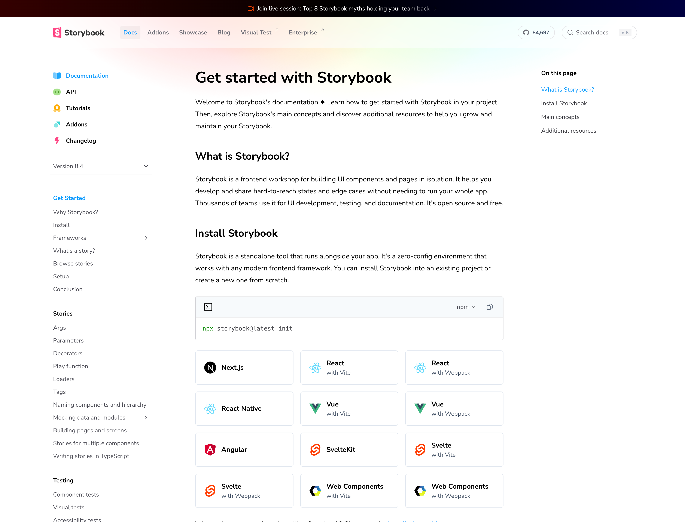

# Storybook との上手な向き合い方を考える

## りんたろー / re-taro

<!--
こんにちは、今日は「Storybook との上手な向き合い方を考える」というテーマでお話しします。

よろしくお願いします。

外部での登壇が2回目なので少々緊張しています。
-->

---


# 自己紹介

## りんたろー

- 三重県の高専で半導体を学んでいます
- 緑色の会社にて今はバイト、来春からちゃんと働きます
- Twitter: [@re_taro\_](https://twitter.com/re_taro_)
- GitHub: [re-taro](https://github.com/re-taro)
- すきなこと
  - 開発者体験に思いを馳せること

<!--
はじめに軽く自己紹介します。

糸川 倫太朗と言います。りんたろーという名前とこのアイコンで色んなとこに出没しています。フリーランスで受託開発をしながら、三重県の高専で半導体を学んでいます。来春からは緑色の会社で働きます。
-->

---

## 話すこと

#### 僕の考える Storybook と上手に向き合う方法

## ~~話さないこと~~ 話せないこと

#### その具体的な方法

<!--
今日は僕の考える Storybook と上手に向き合う方法についてお話しします。逆に具体的にこうするべきだと結論づけるような話はしません。というか話せません。
-->

---

# 突然ですが

<style scoped>
  section h1 {
    text-align: center;
  }
</style>

<!--
突然ですが、
-->

---

# zero-config 好きですか？

<style scoped>
  section h1 {
    text-align: center;
  }
</style>

<!--
みなさんは zero-config が好きですか？

私は zero-config は虚像だと思っていて、あまり好きではありません。

ただまぁこの話を自分の知り合いに言ったら、「それはひねくれている。こういう場面なら zero-config が便利だよね」と言われることがあります。
-->

---

# zero-config の嬉しさ

- PoC を作る時
- 社内ツールをリポジトリ区切ってシュッと作る時

などなど...

<style scoped>
  section p {
    text-align: right;
  }
</style>

<!--
それは、PoC を作る時や社内ツールをリポジトリ区切ってシュッと作る時など、なんかぱぱっと作ってすぐ運用したり提案に回したりする時には便利だなと思います。
-->

---

# なぜ zero-config の話をしたのか

<style scoped>
  section h1 {
    text-align: center;
  }
</style>

<!--
ところで、なんでお前は zer-config の話をしているんだよって思うじゃないですか...
-->

---



<!--
Storybook のサイトですねぇ的な
-->

---


<style scoped>
  section p {
    display: flex;
    justify-content: center;
  }
</style>

<!--
え、お前 zero-config 謳ってたんか〜い的な
-->

---

# 今日はそんな Storybook のお話をします

<style scoped>
  section h1 {
    text-align: center;
  }
</style>

<!--
今日はそんな自称 zero-config な Storybook のお話をします。
-->

---

# Storybook という選択

- レビュアーとの疎通を取るため
- view の実装に集中するため
- ブラウザ上で実行されるユニットテストを効率的に書くため

などなど...

<style scoped>
  section p {
    text-align: right;
  }
</style>

<!--
皆さんは Storybook を何を目的として使っていますか？

- レビュアーとの疎通を取るため
- view の実装に集中するため
- ブラウザ上で実行されるユニットテストを効率的に書くため

など、言語化してみればいろいろな目的があるかと思います。
-->

---

# Storybook という選択の光

```sh
pnpm dlx storybook@latest init
```

だけでセットアップが終わる！（諸説あり）

<style scoped>
  section p {
    text-align: right;
  }
</style>

<!--
先ほど Storybook を使う目的を挙げましたが、プロジェクト立ち上げ時にそこまで考えて Storybook を導入しましたでしょうか？

`storybook init` だけでセットアップが終わるし(諸説あり)、あると便利だから入れておこうみたいなノリで導入することも少なくないでしょう。
-->

---

# Storybook という選択の闇

```sh
pnpm dlx storybook@latest init
```

~~だけでセットアップが終わる！~~

## プロジェクトの構成に合わせた設定が必要

- 秘伝のタレとなった `babel.config.js` やそれを使う `webpackFinal`
- プロジェクト固有の対応で肥大化した `.storybook/preview.tsx`
- msw や DI コンテナを使ったモックの設定

<style scoped>
  marp-pre + p {
    text-align: right;
  }
</style>

<!--
残念ながらそんなに甘くはありません。

Storybook はプロジェクトの構成に合わせた設定がほぼ必ずと言い切っていいほど必要です。(一部例外として PoC などはそのままでも十分に使える)

その結果、秘伝のタレとなったトランスパイル設定を参照しており、見かけ以上に解読が困難な `.storybook/main.ts` や
render-as-you-fetch や内製している DI コンテナや msw などプロジェクト固有の設定で肥大化した `.storybook/preview.tsx` などが生まれてしまいます。
-->

---


<!--
思うに、Storybook は天秤のようなものだと思います。

天秤の片側には「恩恵」があり、もう片側には「使いこなすための設定」があります。

せっかく導入したんですからたくさん恩恵を受けたいですよね。

ですが、メンテをする覚悟のないまま受ける恩恵を増やすと...
-->

---


<!--
あぁ〜的な
-->

---

## その結果...

- ロストテクノロジー化した、なんか知らんけど動いている Storybook
- 新しく Story が追加されることなく文鎮となった Storybook
- バンドラなどを刷新する際に足枷となるレガシーな Storybook

<!--
結果として、Storybook はメンテされずに放置されるプロジェクトも少なくありません。

厄介なのは、メンテされていないけどなんか動いている Storybook です。
使われていなければ削除すればいいだけですが、使われているとなると話は別です。
ロストテクノロジーとしてずるずるとプロジェクトに残り続けた Storybook は時代の変革に対応する際に足枷となります。
-->

---

# Storybook と上手に向き合う == 天秤を釣り合わせる

ってこと

<style scoped>
  section p {
    text-align: right;
  }
</style>

<!--
今回の話の要点は、Storybook と上手に向き合うことは天秤を釣り合わせることだと思います。
-->

---

## 天秤を釣り合わせるためには

- Storybook を使う目的を明確にする
- 目的から逆算して、受ける恩恵を取捨選択する
- その恩恵を受けるために必要な設定を逆算して、保守する

<!--
そのためには、Storybook を使う目的を明確にし、目的から逆算して受ける恩恵を取捨選択することが大事だと思います。
-->

---

# Storybook を使う目的を明確にする

- レビュー支援
  - コンポーネント単位での挙動確認
  - Story の網羅性をレビュアーが確認 == 仕様の網羅性
  - デザイナーのレビュープロセスに組み込む
- テストに使用する
  - VRT
  - Portable stories を使った Play function の assertion

<!--
手始めに Storybook を使う目的を明確にしてみましょう。

普段 Storybook があると助かるぜ！って瞬間があると思いますが、それはどういった状況でしょうか？

- レビュー支援
  - コンポーネント単位での挙動確認
  - Story の網羅性をレビュアーが確認 == 仕様の網羅性
  - デザイナーのレビュープロセスに組み込む
- テストに使用する
  - VRT
  - Portable stories を使った Play function の assertion
-->

---

# 受ける恩恵

- レビュアーとの疎通を取ることができる
- 実装する際のプレイグラウンド
- カバレッジの計測
- インタラクションのテスト
- VRT

<!--
次に、Storybook を使う目的から逆算して受ける恩恵を整理してみましょう。

- レビュアーとの疎通を取ることができる
- 実装する際のプレイグラウンド
- カバレッジの計測
- インタラクションのテスト
- VRT
-->

---

# 受ける恩恵の取捨選択

- レビュアーとの疎通を取ることができる
- 実装する際のプレイグラウンド
- カバレッジの計測
- インタラクションのテスト
- VRT

Storybook と テスト --> 時期尚早かなぁ...

<style scoped>
  li:nth-child(n+3) {
    opacity: 0.4;
  }
</style>

<!--
これらの恩恵のうち、どれを受けるかを取捨選択することが大事です。

私の見解はかなり最近の(というかこれから？) Storybook 公式とは相反していますが、Storybook にテストを寄せるのは時期尚早だと思っています。
-->

---

# 時期尚早と感じる理由

## Storybook runtime 上でテストする方法に統合されている感覚

- Storybook v6 とかの頃: `composeStory` で `play function` の中身を `jest` with
  `testing-library` でアサーション！
- Storybook v7 とかの頃: インタラクションテスト、a11y、カバレッジ計測を
  `test-runner` を使って行う！
- Storybook v8 とかの頃: `@storybook/test`
  が進歩してきたのでアサーションからカバレッジ計測までを `test-runner` で行う！

--> だんだん Storybook
を起動してあることを前提としたテストの形式になってきている

<!--
時期尚早と感じる理由は、テストが Storybook を起動してあることを前提とした形式になってきているからです。

v6 の頃は `composeStory` を使って Story の実行結果を `jest` でアサーションしていました。

それが v7 v8 とメジャーバージョンを重ねるにつれて、実際のブラウザ上でテストをする方針に切り替わっていきました。
インタラクションテストを小さい単位で実際のブラウザでテストできるのは理想であると思います。

しかし、Storybook が起動していることを前提としたテストの形式になっているため、テストにかかる時間が現在の計算資源では重すぎると感じています。
-->

---

# 現在の Storybook とテストの付き合い方

## Storybook とテストの分離

- Story の肥大化の回避
- テストにかかる時間の短縮

## Storybook を利用したテストの例

- `composeStory` で `play function` の中身を `jest` with `testing-library`
  でアサーション
  - setup file に Storybook の依存が発生するがそこまでコストがかからない
- Storybook 自体の腐敗防止のためのテスト
  - 各 Story が正常に描画されているか

<!--
現在、Storybook とテストは分離して考えることが大事だと思います。
過度に手の込んだ記述をした play function は Story の肥大化を招き、メンテをする際に手間がかかります。

Storybook を利用した気楽なテストの例として、`composeStory` を使って Story の実行結果を元にテストを行う方法があります。
これは実際のブラウザ上でテストを行うよりも軽量で、コストをそこまでかけずに Story の再利用が可能です。
-->

---

# 受ける恩恵から逆算した設定たち

- レビュアーとの疎通を取ることができる
  - view がレンダリングされていて、コンポーネントを動かせれば良い
    - アプリケーションのバンドル設定よりも軽い設定や、別のバンドラをビルダーに使う選択肢もある
  - モックの設定
- 実装する際のプレイグラウンド
  - アプリケーションのバンドル設定と同じ環境である必要がある
    - アプリケーションのバンドル設定をきちんと保守していれば自ずとStorybookも保守される
  - モックの設定

<style scoped>
  section h1 {
    line-height: 1;
  }
</style>

---

## だいたいモックが大変

--> 今に始まったことではない。
僕らにできることは、設計でモックを必要とする箇所を狭めること。

---

# モックに対するアイデア

- API との疎通を含む view に関係するロジックを切り出す
  - API 疎通はアプリケーションの動作確認にて、ロジックは unit test で保証
- 切り出したロジックは DI コンテナを使ってモックが簡単になるようにする
- custom decorator を作成して DI を簡単にする

---

## 注意！:warning:

ここまで話してきたことは、気楽な Storybook との付き合い方。

--> スタートダッシュの時にエイヤでいれた Storybook を腐らせないための方法

プロダクトが成熟したりチームの規模が大きくなった、もしくは基盤改善が好きな人材が増えた場合などは、少しずつ天秤にかける重み（得る恩恵）を変えていくことが大事。

<!--
最後になりますが、ここまで話してきたことは、気楽な Storybook との付き合い方です。

プロダクトの伸び方やチームの規模などによっては、Storybook との付き合い方を見直していくことが大事だと思います。
-->

---

# まとめ

- Storybook は便利だが、使い方を間違えると足枷になる
- Storybook を使う目的を明確にし、受ける恩恵を取捨選択する
  - Storybook とテストは分離して考えることが大事 (現時点では)
- 受ける恩恵から逆算して、必要な設定を整理する
- 徐々に Storybook との付き合い方を見直していくことが大事

<!--
まとめです。

この発表ではこれらのことを伝えるとともに、少しでもみなさんが Storybook を採用する際に考え、検討するためのきっかけとなれば幸いです。

ここまでお付き合いいただき、ありがとうございました。
-->
